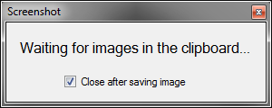

# screenshot

A program for automatically saving screenshots

## Description

This program will save every screenshot you make (using the "Prt Scrn" key on your keyboard) automatically in your "My Pictures" folder (in a separate Screenshots folder). The program will close itself after saving an image by default. You can disable this behaviour by checking the checkbox. The program will open the screenshots folder after closing.

## Requirements

- Windows (Mono compatibility not tested)
- At least .NET Framework 4.5.2
